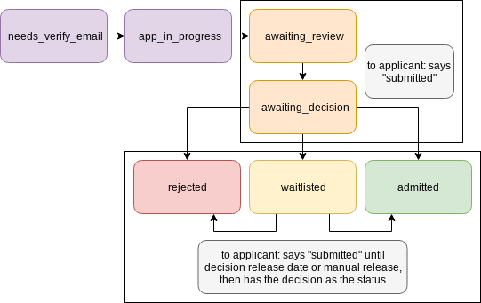

Registration for uncommon hacks.

### the actual webapp

Here's how state happens when people apply.



## infrastructure!!

start by asking Claude or Ben to make you an account on the uncommonhacks AWS. Then go to IAM and generate yourself some keys.

to set this up, install `aws-cli` onto your dev machine, then run `aws configure` and put in the key stuff from IAM.

After that you should be good to just run `zappa update` from the main directory and itll push to the dev lambda w00t

### how to make a superuser

`zappa invoke --raw dev "from django.contrib.auth.models import User; User.objects.create_superuser('admin', 'admin@yourdomain.com', 'horse battery stapler')"`

### how to migrate the database

```
python manage.py makemigrations
zappa update dev
zappa manage dev migrate
```

### AWS SSM Parameter Store Config

*this is already done on the uncommonhacks aws*

set django-registration-url to be the hostname part of the URL that zappa gives you when you run zappa update. Should be of type String.

set registration-django-secret-key (type SecureString) to be the "secret key" from django's settings.py. it should just be a long random string lol

set the database parameters to be... right lol

### static s3 bucket

make a second s3 bucket and put it in settings.py. should be public-readable, owner-only writable. don't put anything sensitive in there, it's public-readable!!!
